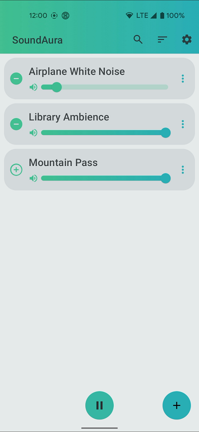
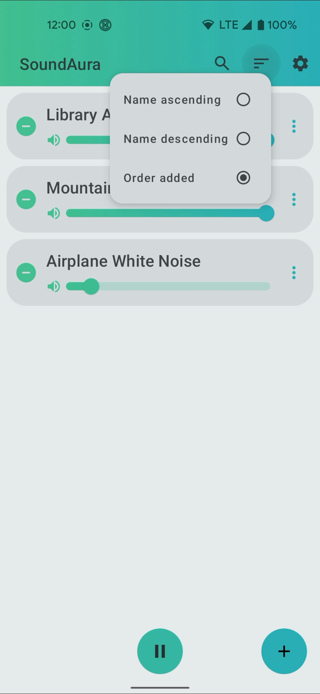
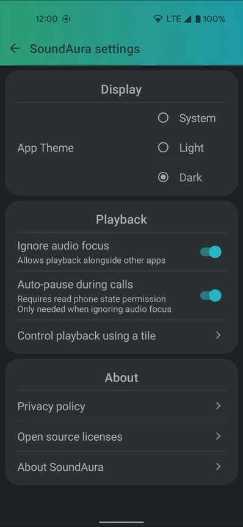
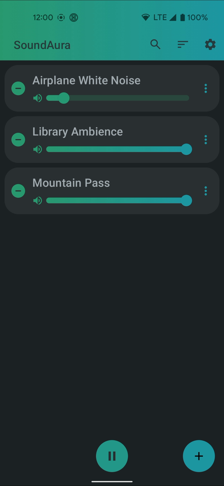

# SoundAura

SoundAura is an open source ambient sound app. It does not include any audio
tracks to save on download size, but allows users to add local files from
their device and play any (reasonable) number of them concurrently, with
individual volume controls for each track. SoundAura can also switch between
an audio focus respecting mode, and an ignore audio focus mode. Ignoring
audio focus will allow SoundAura to play audio alongside other apps.
  
SoundAura is built using:
- Kotlin
- MVVM paradigm (though without a repository layer due to there being only one data source)
- Room persistence library and Jetpack DataStore for the data
- Jetpack Compose for the UI
- Hilt for dependency injection
- Junit and Robolectric for testing

## Features
- A library of user-added tracks based on the device's local files.
- Individual track volume control
- A media notification to control playback when the app is in the background.
- A quick settings tile to control playback. If the quick settings tile
  is in use, the notification can be manually hidden if desired to save
  notification space.
- Auto-pause during calls. If SoundAura is respecting audio focus rules,
  then auto-pausing during phone calls will happen automatically due to
  the app losing audio focus. If audio focus is ignored, SoundAura requires
  the read phone state permission to be able to detect when a phone call is
  ongoing. Auto-pause during calls when ignoring audio focus is toggled on
  in the app settings.
- Auto-pause on audio-device changes: If SoundAura is playing, and an
  audio device change occurs that results in a system media volume of
  zero (e.g. the user unplugs or disconnects their headphones and the
  device's media volume is zero for its speaker), SoundAura will auto-pause
  its playback since it can't be heard anyways. If another audio device
  change occurs that makes the media volume go above zero, SoundAura
  will also automatically unpause itself unless the user manually
  affected the playback state in the mean time.
- No permissions required, except the read phone state permission for the
  optional auto-pause during calls when ignoring audio focus.

## Screenshots

https://user-images.githubusercontent.com/42116365/171025181-05d4769b-f0aa-4a43-86c8-e8e9da5c2866.mp4

## Privacy Policy
SoundAura does not collect, store, or transmit any personal information.

## License
SoundAura's source code is released under the terms of the Apache License,
version 2.0. See the file 'license' in the repository's root directory to
see the full license text.
