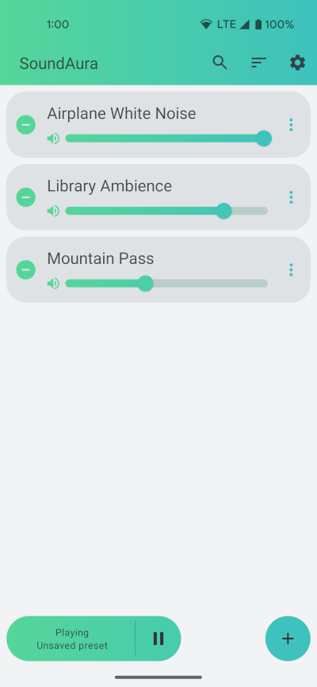
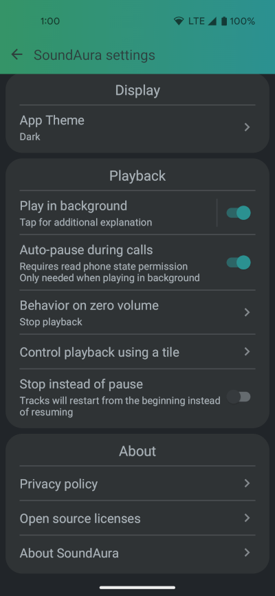
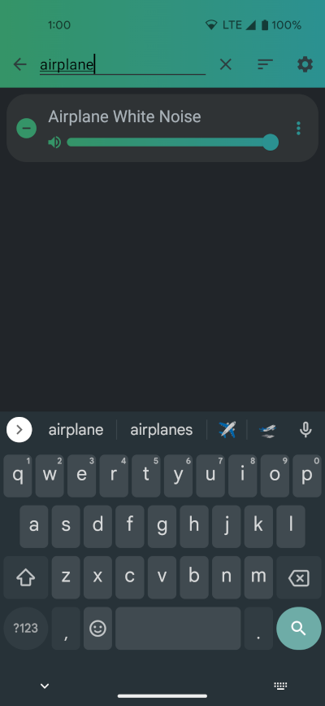

# SoundAura

SoundAura is an open source ambient sound app. It does not include any audio
tracks to save on download size, but allows users to add local files from
their device and play any (reasonable) number of them concurrently, with
individual volume controls for each track. SoundAura can also switch between
an audio focus respecting mode, and a 'play in background' mode that ignores
audio focus rules and allows SoundAura to play audio alongside other apps.
  
SoundAura is built using:
- Kotlin
- MVVM paradigm (though without a repository layer due to there being only one data source)
- Room persistence library and Jetpack DataStore for the data
- Jetpack Compose for the UI
- Hilt for dependency injection
- Junit and Robolectric for testing

## Features
- A library of tracks added from the device's local files, with individual
  volume controls for each track.
- User created presets of tracks
- An automatic stop timer set by long pressing the play/pause button.
- A media notification to control playback when the app is in the background.
  These controls will appear with other media session controls if 'play in
  background' is turned off, or as a regular notification when 'play in
  background' is turned on.
- A quick settings tile to control playback. If the quick settings tile
  is in use, the notification can be manually hidden if desired to save
  notification space.
- Auto-pausing during calls (if the 'play in background' setting is turned
  on, this additionally requires the read phone state permission).
- Automatic stopping or pausing when switching to a new audio device that
  has a volume of zero (e.g. when switching from a headset to the device's
  speaker when the speaker volume is zero).
- No permissions required, except for the read phone state permission for 
  the optional auto-pause during calls when 'play in background' is turned
  on, and the notification permission for Android 13 and up.

## Screenshots

https://user-images.githubusercontent.com/42116365/192111969-21b03711-e844-47c2-a637-54f3917c5f9d.mp4

  
  
  
  

## Privacy Policy
SoundAura does not collect, store, or transmit any personal information.

## License
SoundAura's source code is released under the terms of the Apache License,
version 2.0. See the file 'license' in the repository's root directory to
see the full license text.
